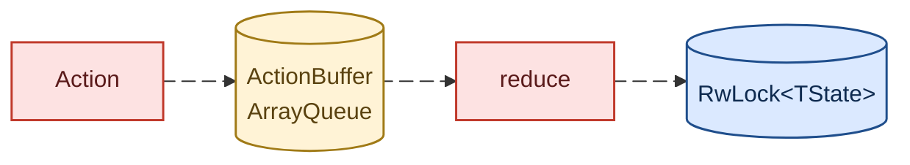

# Rome

## State

State is owned by a single `Store<TState>`. All mutations go in through
dispatched `Action`s and reads come out through borrowed `Selector`
snapshots — direct mutation is not permitted.

### Write path: dispatch → flush

`Store::dispatch` is non-blocking under normal conditions: the action is
boxed and pushed onto an `ActionBuffer` (a bounded, lock-free
multi-producer `ArrayQueue`). The buffer applies backpressure — if it
fills up, `dispatch` spins briefly and then yields the thread until space
opens. Pushes are never dropped.

`Store::flush` drains the buffer into a `Vec`, takes the `RwLock` write
guard, and runs each action's reducer in order against the live state.
A flush with an empty buffer is a no-op and never touches the lock.
`Drop` calls `flush` if the buffer is non-empty so queued actions are
not silently lost.



#### Ordering & concurrency

- The `ArrayQueue` is FIFO, but interleaving across producers is decided
  by atomic arrival order. Non-commutative reducers can produce different
  final states under contention.
- `flush` serializes through the `RwLock` write guard. Concurrent
  flushers are correct but wasteful; prefer a single flusher.
- `dispatch` does not flush. State only advances when something calls
  `flush` (or the store is dropped).

### Read path: select → Selector

`Store::select` takes a projection `Fn(&TState) -> T` and returns a
borrowed `Selector<'_, TState, T>`. The selector holds an
`RwLockReadGuard` for its lifetime and projects lazily on first access,
caching the result in a `OnceCell` for repeated reads.

A `Selector` is a **snapshot**, not a live view. It captures whatever
state was visible the moment `select` was called and never updates. To
observe a newer value, call `select` again after a flush.

Access goes through trait impls — the projected value has no inherent
accessor:

| Trait | Use |
| --- | --- |
| `Deref<Target = T>` | `*sel` to get `&T` for comparison or arithmetic |
| `AsRef<T>` | `sel.as_ref()` when you need an explicit reference |
| `PartialEq<U>` where `T: PartialEq<U>` | `assert_eq!(*sel, value)` |
| `Debug` / `Display` | forward to `T`'s impl |

```mermaid
flowchart LR
    Caller([caller]):::caller
    State[(RwLock&lt;TState&gt;)]:::store
    Guard[RwLockReadGuard]:::lock
    Project[project: &TState → T]:::project
    Cache[OnceCell&lt;T&gt;]:::cache
    Selector[Selector&lt;'a, TState, T&gt;]:::read

    Caller -- "select(project)" --> State
    State -- "read()" --> Guard
    Guard --> Selector
    Project --> Selector
    Selector -- "*sel / as_ref()" --> Cache
    Cache -- "get_or_init(project)" --> Project

    classDef caller fill:#eee,stroke:#555,color:#222
    classDef store fill:#dbe9ff,stroke:#1f4e8c,stroke-width:1.5px,color:#0e2a4f
    classDef lock fill:#e6dcff,stroke:#5b3aa8,stroke-width:1.5px,color:#2a1858
    classDef project fill:#fde2e2,stroke:#c0392b,stroke-width:1.5px,color:#5a1a1a
    classDef cache fill:#fff3d6,stroke:#a07a16,stroke-width:1.5px,color:#5a4210
    classDef read fill:#ddf3e0,stroke:#1f7a3a,stroke-width:1.5px,color:#0e3a1f
```



#### Holding the guard across dispatch+flush

Because `Selector` holds a read guard, a thread that holds a `Selector`
and then calls `flush` on the same `Store` will deadlock waiting on the
write guard. Drop the selector before flushing:

```rust
let n = *store.select(|c| c.n);   // selector dropped at end of statement
store.dispatch(Bump);
store.flush();                    // safe; no read guards outstanding
```

### Trigger

```rust
trait Trigger<TAction: Action> {
    fn trigger(
        &self,
        state: &TAction::State,
        action: &TAction,
    ) -> impl Future<Output = impl Stream<Item = TAction>>;
}
```

A `Trigger` is the side-effecting counterpart to a reducer. Reducers
synchronously derive new state from an action; triggers observe the
current state and incoming action and may produce further actions to
dispatch back into the store.
