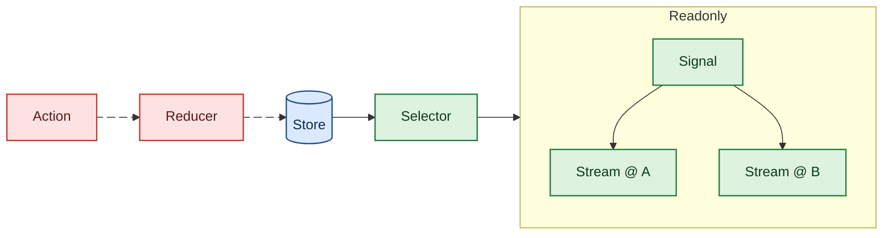
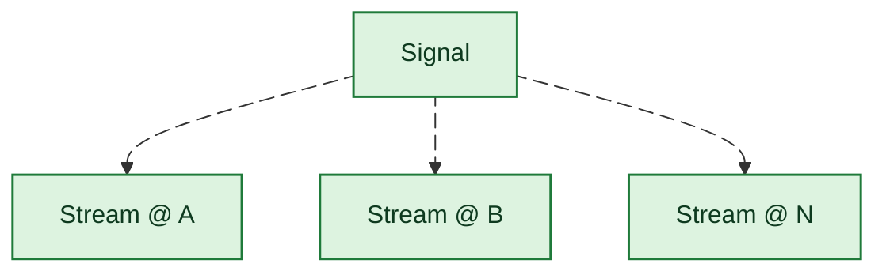

# Rome

## State

### Global

The **global** state is the canonical, app-wide store. All mutations enter
through dispatched `Action`s, which reducers apply to produce a new state
value. Each new state value flows through registered selectors; when a
selector's output changes, its `Signal` notifies subscribers. Actions are
the only way state changes — direct mutation is not permitted.

### Local

The **local** view is read-only. A `Signal` is a broadcaster that
subscribers attach to via `Stream` handles. Each `Stream` receives the
latest value from the `Signal`; subscribers cannot mutate — they can only
observe. To change state, a subscriber must dispatch a new `Action` back
into the global store.

