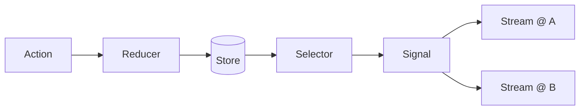
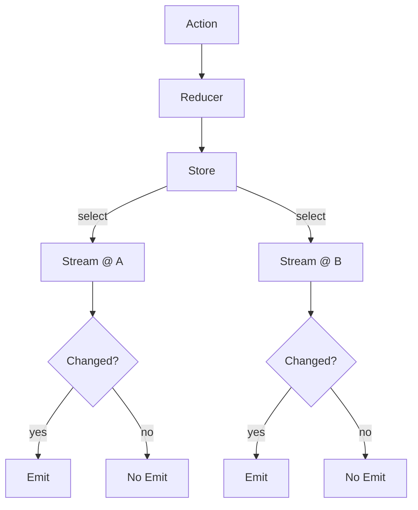

# Rome

## State

```mermaid
flowchart LR
    Action[Action] --> Reducer
    Reducer --> State[(Store)]

    State --> Selector[Selector]
    Selector --> Signal
    Signal --> StreamA[Stream @ A]
    Signal --> StreamB[Stream @ B]
```

### Select

```mermaid
flowchart TD
    Dispatch[Action] --> Reducer
    Reducer --> Store

    Store -->|select| SelA[Stream @ A]
    Store -->|select| SelB[Stream @ B]

    SelA --> CmpA{Changed?}
    SelB --> CmpB{Changed?}

    CmpA -->|yes| StreamA[Emit]
    CmpB -->|yes| StreamB[Emit]

    CmpA -->|no| NoopA[No Emit]
    CmpB -->|no| NoopB[No Emit]
```
