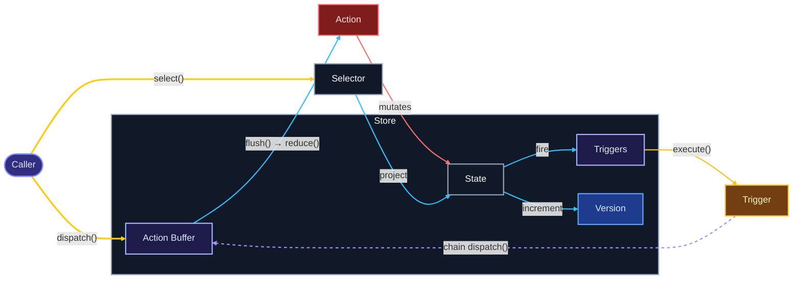

# State Management

```mermaid
flowchart LR
    Caller(["Caller"])

    subgraph StoreBox["Store"]
        direction TB
        Buffer["Action Buffer"]
        State["State"]
        Triggers["Triggers"]
        Version["Version"]
    end

    Action["Action"]
    Trigger["Trigger"]
    Selector["Selector"]

    Caller -- "dispatch()" --> Buffer
    Buffer -- "flush() → reduce()" --> Action
    Action -- "mutates" --> State
    State -- "increment" --> Version
    State -- "fire" --> Triggers
    Triggers -- "execute()" --> Trigger
    Trigger -. "chain dispatch()" .-> Buffer

    Caller -- "select()" --> Selector
    Selector -- "project" --> State

    classDef world fill:#312e81,stroke:#818cf8,stroke-width:2px,color:#e0e7ff
    classDef store fill:#111827,stroke:#94a3b8,stroke-width:2px,color:#f8fafc
    classDef node fill:#1e3a8a,stroke:#60a5fa,stroke-width:2px,color:#dbeafe
    classDef action fill:#7f1d1d,stroke:#f87171,stroke-width:2px,color:#fee2e2
    classDef trigger fill:#713f12,stroke:#fbbf24,stroke-width:2px,color:#fef3c7
    classDef queue fill:#1e1b4b,stroke:#a5b4fc,stroke-width:2px,color:#e0e7ff

    class Caller world
    class StoreBox,State,Selector store
    class Version node
    class Buffer queue
    class Triggers queue
    class Action action
    class Trigger trigger

    linkStyle 0 stroke:#facc15,stroke-width:3px
    linkStyle 1 stroke:#38bdf8,stroke-width:2px
    linkStyle 2 stroke:#f87171,stroke-width:2px
    linkStyle 3 stroke:#38bdf8,stroke-width:2px
    linkStyle 4 stroke:#38bdf8,stroke-width:2px
    linkStyle 5 stroke:#fbbf24,stroke-width:2px
    linkStyle 6 stroke:#a78bfa,stroke-width:2px,stroke-dasharray:5 5
    linkStyle 7 stroke:#facc15,stroke-width:3px
    linkStyle 8 stroke:#38bdf8,stroke-width:2px
```
