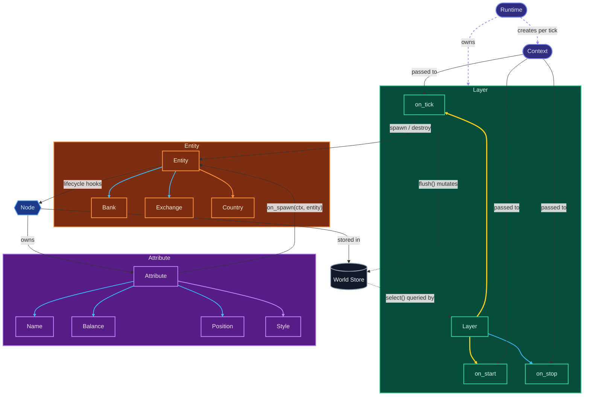

# LEA: Layer Entity Attribute

```mermaid
flowchart TD
    Runtime(["Runtime"])
    Context(["Context"])

    subgraph LayerBox["Layer"]
        direction TB
        Layer["Layer"]
        Start["on_start"]
        Tick["on_tick"]
        Stop["on_stop"]
        Layer --> Start
        Layer --> Tick
        Layer --> Stop
    end

    subgraph EntityBox["Entity"]
        direction TB
        Entity["Entity"]
        Bank["Bank"]
        Exchange["Exchange"]
        Country["Country"]
        Entity --> Bank
        Entity --> Exchange
        Entity --> Country
    end

    subgraph AttributeBox["Attribute"]
        direction TB
        Attribute["Attribute"]
        Name["Name"]
        Balance["Balance"]
        Position["Position"]
        Style["Style"]
        Attribute --> Name
        Attribute --> Balance
        Attribute --> Position
        Attribute --> Style
    end

    Store[("World Store")]
    Node{{"Node"}}

    Runtime -- "owns" --> LayerBox
    Runtime -- "creates per tick" --> Context
    Context -- "passed to" --> Start
    Context -- "passed to" --> Tick
    Context -- "passed to" --> Stop

    Tick -- "spawn / destroy" --> Entity
    Entity -- "lifecycle hooks" --> Node
    Node -- "stored in" --> Store
    Node -- "owns" --> Attribute
    Attribute -- "on_spawn(ctx, entity)" --> Entity

    Tick -. "flush() mutates" .-> Store
    Store -. "select() queried by" .-> Layer

    classDef world fill:#312e81,stroke:#818cf8,stroke-width:2px,color:#e0e7ff
    classDef layer fill:#064e3b,stroke:#34d399,stroke-width:2px,color:#d1fae5
    classDef entity fill:#7c2d12,stroke:#fb923c,stroke-width:2px,color:#ffedd5
    classDef attribute fill:#581c87,stroke:#c084fc,stroke-width:2px,color:#f3e8ff
    classDef node fill:#1e3a8a,stroke:#60a5fa,stroke-width:2px,color:#dbeafe
    classDef store fill:#111827,stroke:#94a3b8,stroke-width:2px,color:#f8fafc

    class Runtime,Context world
    class LayerBox,Layer,Start,Tick,Stop layer
    class EntityBox,Entity,Bank,Exchange,Country entity
    class AttributeBox,Attribute,Name,Balance,Position,Style attribute
    class Node node
    class Store store

    linkStyle 0 stroke:#facc15,stroke-width:3px
    linkStyle 1 stroke:#facc15,stroke-width:3px
    linkStyle 2 stroke:#38bdf8,stroke-width:2px
    linkStyle 3 stroke:#38bdf8,stroke-width:2px
    linkStyle 4 stroke:#38bdf8,stroke-width:2px
    linkStyle 5 stroke:#fb923c,stroke-width:2px
    linkStyle 6 stroke:#38bdf8,stroke-width:2px
    linkStyle 7 stroke:#38bdf8,stroke-width:2px
    linkStyle 8 stroke:#38bdf8,stroke-width:2px
    linkStyle 9 stroke:#c084fc,stroke-width:2px
    linkStyle 10 stroke:#a78bfa,stroke-width:2px,stroke-dasharray:5 5
    linkStyle 11 stroke:#a78bfa,stroke-width:2px,stroke-dasharray:5 5
```
