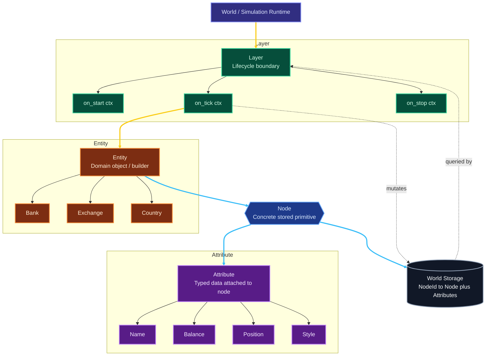

# LEA: Layer Entity Attribute

```mermaid
flowchart TD
    World["World / Simulation Runtime"]

    subgraph LayerGraph["Layer"]
        direction TB
        Layer["Layer<br/>Lifecycle boundary"]
        Start["on_start ctx"]
        Tick["on_tick ctx"]
        Stop["on_stop ctx"]
    end

    subgraph EntityGraph["Entity"]
        direction TB
        Entity["Entity<br/>Domain object / builder"]
        Bank["Bank"]
        Exchange["Exchange"]
        Country["Country"]
    end

    subgraph AttributeGraph["Attribute"]
        direction TB
        Attribute["Attribute<br/>Typed data attached to node"]
        Name["Name"]
        Balance["Balance"]
        Position["Position"]
        Style["Style"]
    end

    Node{{"Node<br/>Concrete stored primitive"}}
    Store[("World Storage<br/>NodeId to Node plus Attributes")]

    World --> Layer

    Layer --> Start
    Layer --> Tick
    Layer --> Stop

    Tick --> Entity

    Entity --> Bank
    Entity --> Exchange
    Entity --> Country

    Entity --> Node
    Node --> Store
    Node --> Attribute

    Attribute --> Name
    Attribute --> Balance
    Attribute --> Position
    Attribute --> Style

    Tick -. "mutates" .-> Store
    Store -. "queried by" .-> Layer

    classDef world fill:#312e81,stroke:#818cf8,stroke-width:2px,color:#e0e7ff
    classDef layer fill:#064e3b,stroke:#34d399,stroke-width:2px,color:#d1fae5
    classDef entity fill:#7c2d12,stroke:#fb923c,stroke-width:2px,color:#ffedd5
    classDef attribute fill:#581c87,stroke:#c084fc,stroke-width:2px,color:#f3e8ff
    classDef node fill:#1e3a8a,stroke:#60a5fa,stroke-width:2px,color:#dbeafe
    classDef store fill:#111827,stroke:#94a3b8,stroke-width:2px,color:#f8fafc

    class World world
    class Layer,Start,Tick,Stop layer
    class Entity,Bank,Exchange,Country entity
    class Attribute,Name,Balance,Position,Style attribute
    class Node node
    class Store store

    linkStyle 0 stroke:#facc15,stroke-width:3px
    linkStyle 4 stroke:#facc15,stroke-width:3px
    linkStyle 8 stroke:#38bdf8,stroke-width:3px
    linkStyle 9 stroke:#38bdf8,stroke-width:3px
    linkStyle 10 stroke:#38bdf8,stroke-width:3px
```
