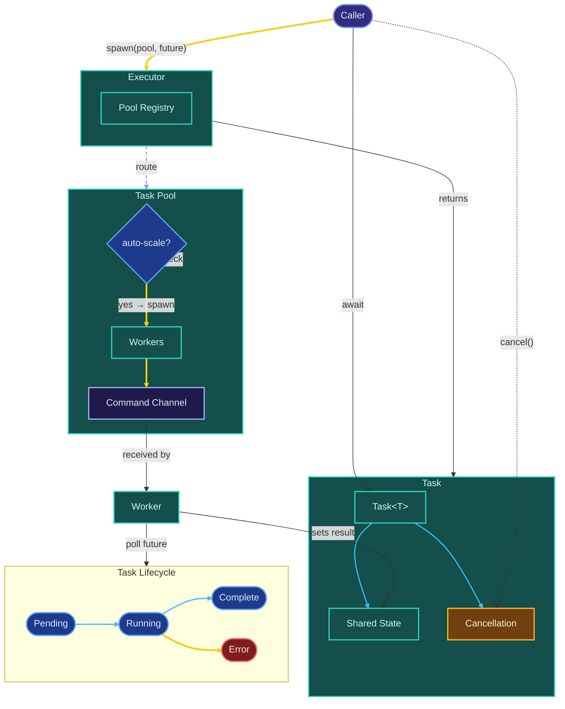

# Tasks

```mermaid
flowchart TD
    Caller(["Caller"])

    subgraph ExecutorBox["Executor"]
        direction TB
        Pool["Pool Registry"]
    end

    subgraph PoolBox["Task Pool"]
        direction TB
        ScaleCheck{"auto-scale?"}
        Workers["Workers"]
        Channel["Command Channel"]
        ScaleCheck -- "yes → spawn" --> Workers
        Workers --> Channel
    end

    subgraph TaskBox["Task"]
        direction TB
        TaskFuture["Task&lt;T&gt;"]
        TaskRun["Shared State"]
        Cancel["Cancellation"]
        TaskFuture --> TaskRun
        TaskFuture --> Cancel
    end

    subgraph LifecycleBox["Task Lifecycle"]
        direction LR
        Pending(["Pending"])
        Running(["Running"])
        Complete(["Complete"])
        Error(["Error"])
        Pending --> Running
        Running --> Complete
        Running --> Error
    end

    Worker["Worker"]

    Caller -- "spawn(pool, future)" --> ExecutorBox
    ExecutorBox -- "route" --> PoolBox
    PoolBox -- "check" --> ScaleCheck
    Channel -- "received by" --> Worker
    Worker -- "poll future" --> LifecycleBox
    Worker -- "sets result" --> TaskRun
    ExecutorBox -- "returns" --> TaskBox
    Caller -- "await" --> TaskFuture
    Caller -. "cancel()" .-> Cancel

    classDef world fill:#312e81,stroke:#818cf8,stroke-width:2px,color:#e0e7ff
    classDef task fill:#134e4a,stroke:#2dd4bf,stroke-width:2px,color:#ccfbf1
    classDef queue fill:#1e1b4b,stroke:#a5b4fc,stroke-width:2px,color:#e0e7ff
    classDef trigger fill:#713f12,stroke:#fbbf24,stroke-width:2px,color:#fef3c7
    classDef node fill:#1e3a8a,stroke:#60a5fa,stroke-width:2px,color:#dbeafe
    classDef action fill:#7f1d1d,stroke:#f87171,stroke-width:2px,color:#fee2e2

    class Caller world
    class ExecutorBox,PoolBox,Pool,Workers,Worker,TaskBox,TaskFuture,TaskRun task
    class Channel queue
    class Cancel trigger
    class ScaleCheck,Pending,Running,Complete node
    class Error action

    linkStyle 0 stroke:#facc15,stroke-width:3px
    linkStyle 1 stroke:#facc15,stroke-width:3px
    linkStyle 2 stroke:#38bdf8,stroke-width:2px
    linkStyle 3 stroke:#38bdf8,stroke-width:2px
    linkStyle 4 stroke:#38bdf8,stroke-width:2px
    linkStyle 5 stroke:#38bdf8,stroke-width:2px
    linkStyle 6 stroke:#facc15,stroke-width:3px
    linkStyle 7 stroke:#facc15,stroke-width:3px
    linkStyle 8 stroke:#a78bfa,stroke-width:2px,stroke-dasharray:5 5
```
